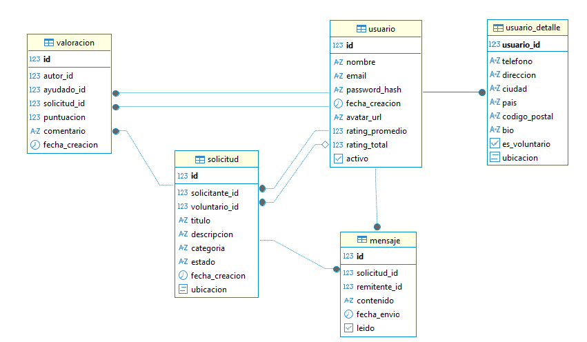

# VecinoTech

**VecinoTech** es una plataforma solidaria que conecta a vecinos que necesitan ayuda con problemas tecnológicos con otros que pueden ofrecer asistencia.  
El objetivo es fomentar la inclusión digital y el apoyo comunitario, especialmente entre personas mayores o con menos experiencia tecnológica.

---

## 🚀 Tecnologías utilizadas

### Frontend
- **Angular 19**
- **Tailwind CSS**
- **TypeScript**
- **Leaflet.js**
- **JWT Authentication**

### Backend
- **Spring Boot 3.5.4 (Java 21)**
- **Spring Security + JWT**
- **PostgreSQL**
- **MapStruct** y **DTOs**
- **Flyway** ---> para migraciones

### Base de datos

### EndPoints (con Postman)

A continuación se listan algunos endpoints utilizados para pruebas locales con **Postman**.

### Login
**URL**: localhost:8080/api/zonaUsuario/login

**Body (JSON):**

{
  "email": "matrix_reload@gmail.com",
  "password": "Morfeo12345!"
}

### Actualizar Geolocalización 
**URL**: localhost:8080/api/portal/ubicacion/actualizar

**con Bearer Token**

**Respuesta esperada**

{

    "codigo": 0,
    "mensaje": "Ubicación actualizada correctamente",
    "datos": {
        "latitud": 40.4726896,
        "longitud": -3.3745243
    }
}
