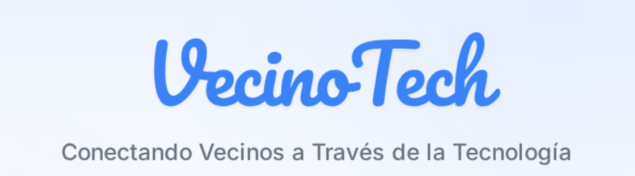

---
## 📋 Información del Proyecto

- **Autor:** Alejandro Nishiky
- **Año académico:** 2025/2026
- **Ciclo:** Desarrollo de Aplicaciones Web (DAW)
- **Centro:** IES Alonso de Avellaneda
- **Licencia:** MIT

---
## 📖 Tabla de Contenidos

1. [Introducción y Justificación](#1-introducción-y-justificación)
2. [Estudio de Viabilidad](#2-estudio-de-viabilidad)
3. [Análisis y Diseño](#3-análisis-y-diseño)
4. [Conclusiones](#4-conclusiones)
5. [Bibliografía](#5-bibliografía)
6. [Anexos](#6-anexos)

## 1. Introducción y Justificación

### 1.1. Descripción del Proyecto

**VecinoTech** es una plataforma web colaborativa que conecta a personas con diferentes niveles de conocimiento tecnológico, facilitando el intercambio de ayuda en el ámbito digital. Los usuarios con dificultades tecnológicas (solicitantes) reciben asistencia gratuita de voluntarios de su comunidad para resolver problemas cotidianos relacionados con la tecnología.

**Finalidad:** Reducir la brecha digital creando un puente entre generaciones y niveles de alfabetización digital, democratizando el acceso al conocimiento tecnológico sin barreras económicas ni desplazamientos.

**Objetivos principales:**
- **Sociales:** Facilitar la inclusión digital, fomentar la solidaridad entre vecinos y proporcionar asesoramiento tecnológico gratuito
- **Técnicos:** Desarrollar una aplicación full-stack con geolocalización, comunicación en tiempo real (chat/videollamadas) e interfaces diferenciadas por perfil
- **Educativos:** Demostrar competencias avanzadas en desarrollo web, bases de datos geoespaciales e integración de múltiples tecnologías

### 1.2. Motivación

Este proyecto nace de una **vocación de servicio** y el deseo de contribuir a la sociedad mediante la tecnología. Inspirado en **BeMyEyes** (aplicación que conecta personas con discapacidad visual con voluntarios) adapté este modelo de ayuda persona a persona al ámbito tecnológico.

**El problema:** La tecnología avanza a pasos agigantados, convirtiéndose en imprescindible para gestiones bancarias, citas médicas o comunicación familiar. Sin embargo, lo que para algunos es trivial (configurar email, instalar aplicaciones, usar videollamadas), para otros representa una barrera significativa. Muchas personas se sienten excluidas, frustradas o terminan pagando por resolver dudas simples.

**La solución:** VecinoTech ofrece asesoramiento gratuito, inmediato y sin desplazamientos. Un voluntario puede dedicar 10 minutos a ayudar con una configuración, y para esa persona puede significar la diferencia entre comunicarse con sus nietos o sentirse aislada.

Este proyecto refleja la convicción de que **la tecnología debe incluir, no excluir**. VecinoTech no es solo un ejercicio académico, es un compromiso con la inclusión digital y la solidaridad comunitaria.

---
## 2. Estudio de la Viabilidad del Proyecto

### 2.1. Viabilidad Económica

#### Estimación de Costos

**Estado actual (Desarrollo - TFG):**

El desarrollo del proyecto se ha realizado completamente en entorno local sin costes asociados:

| Recurso | Coste |
|---------|-------|
| Herramientas de desarrollo (VS Code, IntelliJ IDEA, Git) | 0€ |
| PostgreSQL + PostGIS | 0€ |
| Node.js, Angular CLI, Maven | 0€ |
| APIs externas (Nominatim, Jitsi Meet) | 0€ |
| Almacenamiento local de imágenes | 0€ |
| **Total inversión actual** | **0€** |

**Costos estimados para producción:**

Para un despliegue en producción con capacidad inicial de hasta 1000 usuarios activos:

| Recurso | Coste mensual | Coste anual |
|---------|---------------|-------------|
| Hosting VPS (2GB RAM, 50GB SSD) | 5-10€ | 60-120€ |
| Dominio (.es o .com) | - | 10-15€ |
| Certificado SSL | 0€ (Let's Encrypt) | 0€ |
| Mailjet (plan gratuito: 6000 emails/mes) | 0€ | 0€ |
| Base de datos PostgreSQL (incluida en VPS) | 0€ | 0€ |
| Backup y mantenimiento | 2-5€ | 24-60€ |
| **Total estimado** | **7-15€/mes** | **94-195€/año** |

**Costos escalables (>1000 usuarios):**

- VPS de mayor capacidad: 15-30€/mes
- CDN para imágenes (Cloudinary, plan gratuito inicial): 0-20€/mes
- Plan de emails superior: 10-25€/mes
- **Total escalado:** 25-75€/mes (300-900€/año)

#### Retorno de la Inversión (ROI)

**Modelo de negocio:** VecinoTech está concebido como un proyecto **100% gratuito y sin ánimo de lucro**, orientado al impacto social más que al beneficio económico.

**Posibles fuentes de financiación futura:**

1. **Donaciones voluntarias**
   - Sistema de donaciones opcionales de usuarios satisfechos
   - Crowdfunding (Kickstarter, Patreon, GoFundMe)
   - Estimación conservadora: 50-200€/año

2. **Subvenciones y ayudas públicas**
   - Ayuntamientos interesados en inclusión digital
   - Programas de innovación social
   - Fondos europeos para brecha digital
   - Potencial: 1000-5000€ (puntual)

3. **Patrocinios corporativos**
   - Empresas tecnológicas con programas de RSC
   - Operadoras de telecomunicaciones
   - Organizaciones sin ánimo de lucro
   - Potencial: 500-2000€/año

**Análisis de ROI:**

Dado el **carácter social del proyecto**, el retorno de inversión no se mide en términos puramente económicos:

| Tipo de ROI | Descripción |
|-------------|-------------|
| **ROI Económico** | Recuperación de costes básicos (100-200€/año) mediante donaciones: **12-24 meses** |
| **ROI Social** | Impacto en reducción de brecha digital: **Inmediato** desde el primer usuario ayudado |
| **ROI Educativo** | Valor del aprendizaje técnico adquirido: **Incalculable** para desarrollo profesional |

**Conclusión de viabilidad económica:**

El proyecto es **económicamente viable** con una inversión mínima (<200€/año) que puede ser cubierta mediante donaciones voluntarias o microfinanciación. El verdadero valor de VecinoTech reside en su **impacto social**, generando un retorno intangible pero significativo en forma de inclusión digital y fortalecimiento comunitario.

La sostenibilidad a largo plazo no depende de generar beneficios, sino de mantener costes controlados y construir una comunidad comprometida con la misión del proyecto.

---
